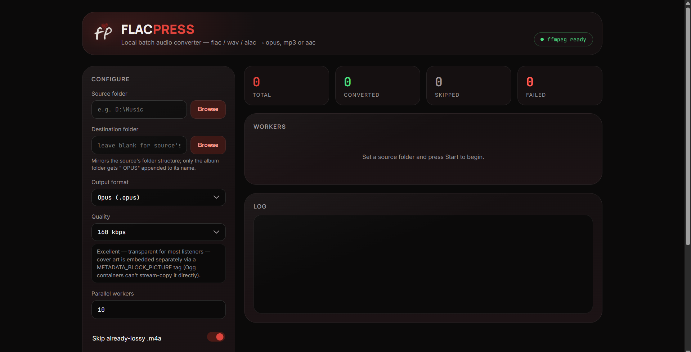

<p align="center">
  
</p>

<h1 align="center">FlacPress</h1>

<p align="center">
Batch convert your lossless music library to high-quality <b>Opus</b>, <b>MP3</b>, or <b>AAC</b> with parallel processing, full metadata preservation, embedded cover art, and a clean local web interface.
</p>

<p align="center">


</p>

---

## Features

- 🎵 Convert **FLAC, WAV, AIFF, ALAC, APE, and WavPack**
- 🚀 Fast parallel conversion using multiple worker processes
- 🎨 Preserves embedded album artwork (including **Opus**)
- 🏷️ Copies metadata using **Mutagen** for maximum compatibility
- 📁 Mirrors your existing folder structure automatically
- 🧠 Detects whether `.m4a` files contain **ALAC** or **AAC**
- 🛑 Real cancellation that immediately terminates running FFmpeg jobs
- ✅ Output verification with FFprobe
- 🧪 Dry-run mode
- 💻 Modern local web UI
- 🖥️ CLI included for terminal users

---

## Supported Formats

| Input | Output |
|-------|--------|
| FLAC | Opus |
| WAV | MP3 |
| AIFF | AAC |
| ALAC (.m4a) | |
| Monkey's Audio (APE) | |
| WavPack (WV) | |

---

## Screenshot




---

# Installation

### Clone the repository

```bash
git clone https://github.com/seshapriyan44/FlacPress.git
cd FlacPress
```

### Install dependencies

```bash
pip install -r requirements.txt
```

### Install FFmpeg

FlacPress requires **FFmpeg** and **FFprobe**.

Verify the installation:

```bash
ffmpeg -version
ffprobe -version
```

Downloads:

https://ffmpeg.org/download.html

---

## Quick Start

Launch the web application:

```bash
python app.py
```

Open

```
http://127.0.0.1:5000
```

Choose:

- Source folder
- Output folder (optional)
- Output format
- Bitrate
- Number of workers

Click **Start Conversion**.

---

# CLI Usage

Convert to Opus:

```bash
python cli.py ~/Music --format opus --bitrate 160k --workers 6
```

Dry run:

```bash
python cli.py ~/Music --format mp3 --bitrate 0 --dry-run
```

Windows example:

```bash
python cli.py D:\Music --format opus
```

---

# Desktop Version

FlacPress can also run as a native desktop application using **PyWebView**.

Run:

```bash
python desktop.py
```

Build an executable:

```bash
pyinstaller --onefile --windowed ^
--name FlacPress ^
--icon static/assets/icon.ico ^
--add-data "static;static" ^
desktop.py
```

macOS/Linux:

```bash
--add-data "static:static"
```

> FFmpeg and FFprobe are **not bundled automatically**. Place them beside the executable or install them system-wide.

---

# Why FlacPress?

Most lossless-to-lossy converters are either simple shell scripts or heavyweight desktop applications.

FlacPress focuses on being:

- Lightweight
- Fast
- Easy to use
- Transparent
- Safe

Instead of hiding everything behind a progress bar, every worker is displayed live so you can monitor conversions in real time.

---

# Design Highlights

### Metadata Preservation

Rather than relying on FFmpeg's `-map_metadata`, FlacPress uses **Mutagen** to preserve metadata more reliably across every supported format.

---

### Embedded Cover Art

Album artwork is preserved for:

- Opus
- MP3
- AAC

For Opus, FlacPress writes a proper `METADATA_BLOCK_PICTURE` tag after encoding.

---

### Smart `.m4a` Detection

`.m4a` may contain either:

- ALAC (lossless)
- AAC (lossy)

FlacPress automatically detects the codec and avoids unnecessary lossy-to-lossy transcoding.

---

### Safe Output Handling

Generated files are never rescanned as input, even when the destination folder is inside the source directory.

---

### Real Cancellation

Cancel immediately terminates active FFmpeg processes instead of waiting for the conversion queue to finish.

---

### Output Verification

Every converted file is verified using FFprobe before being marked as successful.

---

### UI-Independent Engine

The conversion engine is completely independent of the user interface.

The same backend powers:

- Flask Web UI
- CLI
- Desktop application

making future interfaces easy to build.

---

# Default Quality Settings

| Format | Default |
|----------|---------|
| Opus | 160 kbps |
| MP3 | LAME V0 |
| AAC | 192 kbps |

All settings can be overridden from either the UI or CLI.

---

# Project Structure

```
FlacPress/
├── app.py
├── cli.py
├── desktop.py
├── core.py
├── static/
├── requirements.txt
└── LICENSE
```

---

# Requirements

- Python 3.10+
- FFmpeg
- FFprobe

---

# Roadmap

- [ ] Drag & Drop support
- [ ] Dark mode
- [ ] Preset profiles
- [ ] ReplayGain support
- [ ] Portable releases
- [ ] Automatic update checker

---

# Contributing

Pull requests, feature requests, and bug reports are welcome.

If you encounter an issue, please open an issue on GitHub.

---

# Disclaimer

FlacPress **never modifies your original files**.

All converted audio is written to a separate output directory, keeping your source library untouched.

---

# License

Licensed under the MIT License.

See the [LICENSE](LICENSE) file for details.